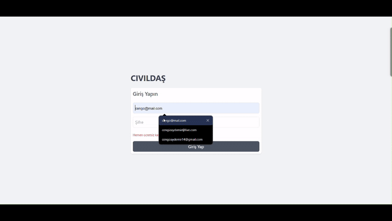

---

# Not Uygulaması

Bu proje, kullanıcıların üyelik oluşturup oturum açtıktan sonra not ekleyebileceği, düzenleyebileceği ve silebileceği bir not uygulamasıdır.  
Backend tarafı **Node.js** ve **MongoDB**, frontend tarafı ise **React** ile geliştirilmiştir.  

## Özellikler

- **Kullanıcı Yönetimi**  
  - Üyelik oluşturma  
  - Oturum açma ve kapatma  

- **Not Yönetimi**  
  - Yeni not ekleme  
  - Not düzenleme  
  - Not silme  

## Kullanılan Teknolojiler

### Backend
- **Node.js**: Server-side uygulama geliştirme  
- **Express.js**: RESTful API oluşturma  
- **MongoDB**: Veritabanı yönetimi  

### Frontend
- **React**: Kullanıcı arayüzü oluşturma  
- **Redux**: Uygulama durum yönetimi  
- **Redux Thunk**: Async işlemleri yönetme  
- **React Router DOM**: Çok sayfalı navigasyon  
- **Axios**: API isteklerini yönetme  
- **React Toastify**: Bildirimler  
- **Tailwind CSS**: Stil ve tasarım  

---

## Kurulum ve Çalıştırma

### Gereksinimler

- Node.js (v16+)
- MongoDB

### Backend

1. **Depoyu klonlayın:**

   ```bash
   git clone https://github.com/cengo14/mern-stack-react-crud-project.git
   cd mern-stack-react-crud-project/backend
   ```

2. **Bağımlılıkları yükleyin:**

   ```bash
   npm install
   ```

3. **Ortam değişkenlerini ayarlayın:**  
   Proje dizininde bir `.env` dosyası oluşturun ve aşağıdaki gibi yapılandırın:

   ```
   MONGO_URI=mongodb://localhost:27017/notuygulamasi
   JWT_SECRET=supersecretkey
   PORT=3090
   ```

4. **Server'ı çalıştırın:**
   ```bash
   npm start
   ```

### Frontend

1. **Frontend dizinine geçin:**

   ```bash
   cd ../frontend
   ```

2. **Bağımlılıkları yükleyin:**

   ```bash
   npm install
   ```

3. **Uygulamayı çalıştırın:**

   ```bash
   npm start
   ```

4. **Uygulamayı açın:**  
   Tarayıcınızda `http://localhost:3000` adresine gidin.

---

## Proje Yapısı

```plaintext
not-uygulamasi/
├── backend/
│   ├── controllers/       # API controller dosyaları
│   ├── config/            # Mongodb bağlantı dosyaları
│   ├── models/            # MongoDB modelleri
│   ├── routes/            # API route dosyaları
│   ├── index.js           # Uygulama giriş noktası
├── frontend/
│   ├── src/
│   │   ├── components/    # React bileşenleri
│   │   ├── hooks/         # Geliştirici tarafından hazırlanan hooklar
│   │   ├── pages/         # Sayfa bileşenleri
│   │   ├── redux/         # Redux store ve slice'ları
│   │   ├── utils/         # Yardımcı fonksiyonlar ve API ayarları
│   │   ├── App.js         # Ana uygulama bileşeni
│   │   ├── index.js       # React giriş noktası
├── README.md
```

---

## Ekran Görüntüleri

**Not Yönetimi:**  
Kullanıcılar notlarını görüntüleyebilir, ekleyebilir, düzenleyebilir veya silebilir.



---

## Katkıda Bulunma

Katkıda bulunmak isterseniz, bir **pull request** göndermekten çekinmeyin. 😊

---

## Lisans

Bu proje MIT lisansı ile lisanslanmıştır. Daha fazla bilgi için `LICENSE` dosyasını kontrol edin.

---
